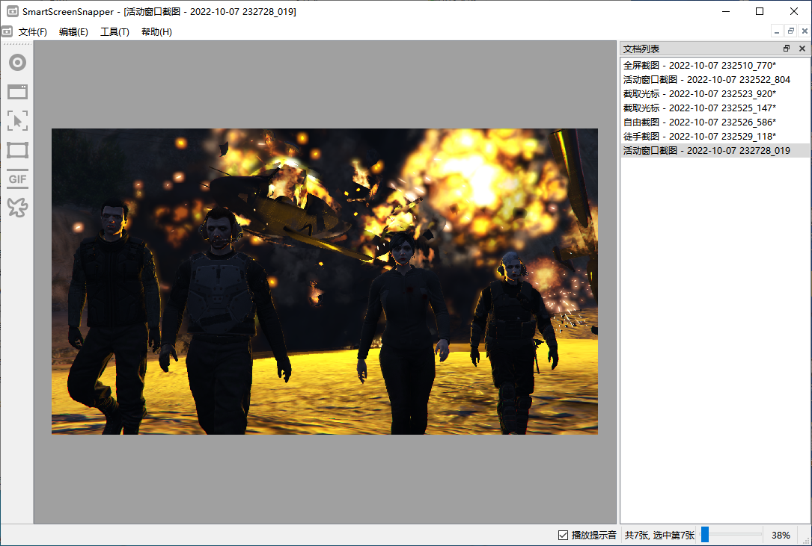
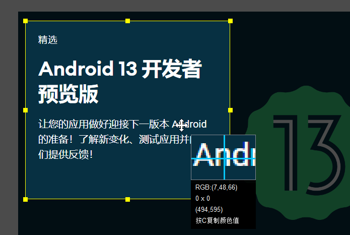
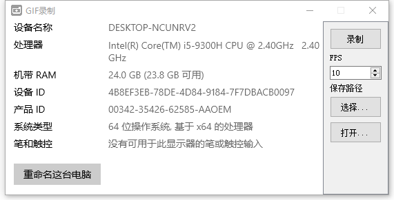
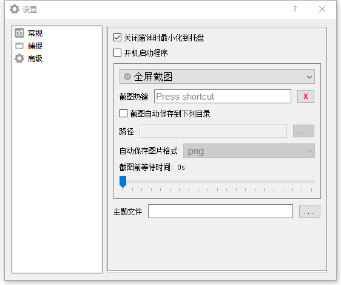
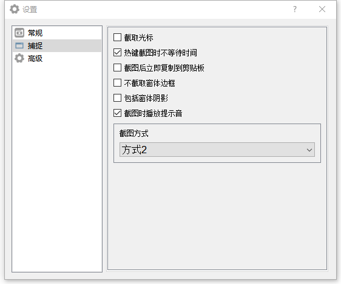

    

        
    

    <h1>📸 SmartScreenSnapper</h1>
    

        
        
        <a href="https://img.shields.io/badge/Windows->=7-brightgreen" style="text-decoration:none" >
            =7-brightgreen" alt="Windows version"/>
        </a>
        
	

    

        一个小巧实用的<b>截图工具</b>，使用Qt5编写。
    

## 💡主要功能

1. 支持**全屏**截图
2. 支持**活动窗口**截图
3. 支持截取**光标**
4. 支持**热键**截图
5. 支持**自由框选截图**
6. 支持**录制GIF**
7. 支持**自动保存**图片
8. 支持**多显示屏**（仅在双显示屏下测试）
9. 支持**最小化**到**托盘**
10. 支持**跟随系统启动**
11. ......

## 🤩应用截图

## 🎉特别感谢

1. minifmod播放**.xm音乐**组件
2. [MyGlobalShortcut](https://github.com/mario206/MyGlobalShortcut)注册**全局热键**(有修改)
3. [gif-h](https://github.com/charlietangora/gif-h)创建**GIF文件**(有修改)

## 📃许可证

使用此软件代码需**遵循以下许可证协议**

[**GNU General Public License v3.0**](LICENSE)
