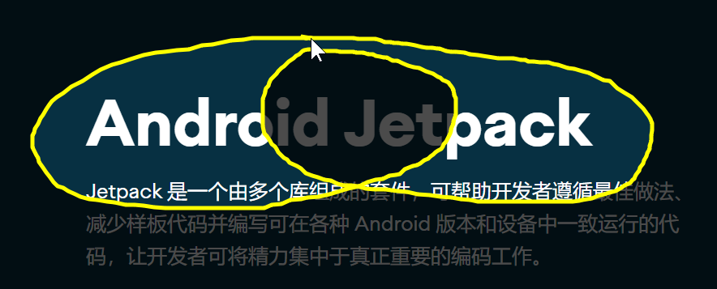
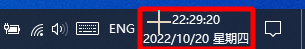
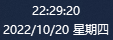

    
    <h1>📸 SmartScreenSnapper</h1>
    

        
        
        <a href="https://img.shields.io/badge/platform-Windows >= 10 x64-brightgreen" style="text-decoration:none" >
            = 10 x64-brightgreen?&style=for-the-badge" alt="Windows version"/>
        </a>
        
	

    

        一个小巧实用的<b>截图工具</b>，使用 Qt 6 编写。
    

## 💡主要功能

1. 支持**全屏**截图
2. 支持**活动窗口**截图
3. 支持截取**光标**
4. 支持**热键**截图
5. 支持**自由框选截图**
6. 支持**徒手绘制**区域**截图**
7. 支持**录制GIF**
8. 支持**自动保存**图片
9. 支持**多显示屏**（仅在双显示屏下测试）
10. 支持**最小化**到**托盘**
11. 支持**跟随系统启动**
12. ......

## 🚧待实现

- **编辑**截图
- **固定区域**截图
- **多区域**截图
- **滚动**长截图（图片**拼接算法**问题待解决）

## 🤩应用截图

#### 首页

#### 自由框选截图

#### **徒手绘制**区域截图

#### 录制GIF

#### 窗体控件截图

#### 常规设置

#### 文件名模板

## 🎉特别感谢

1. [MyGlobalShortcut](https://github.com/mario206/MyGlobalShortcut)注册**全局热键**(有修改)
2. [gif-h](https://github.com/charlietangora/gif-h)创建**GIF文件**(有修改)

## 📃许可证

使用此软件代码需**遵循以下许可证协议**

[**GNU General Public License v3.0**](LICENSE)
